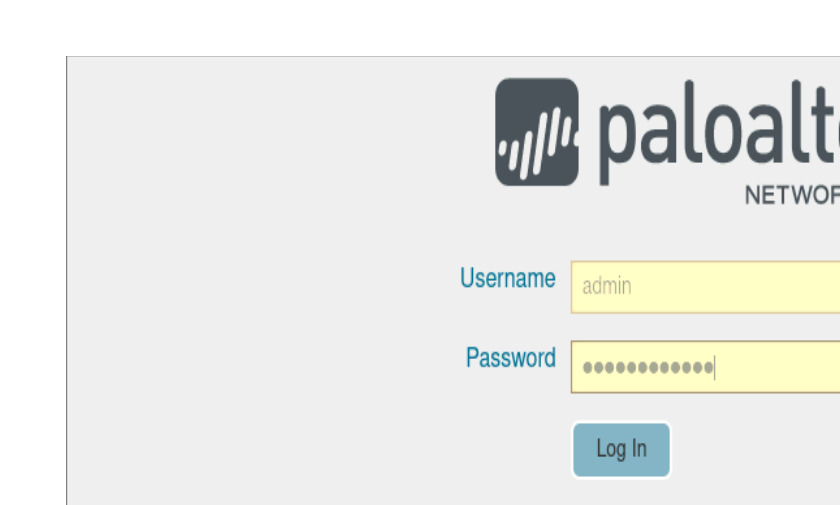
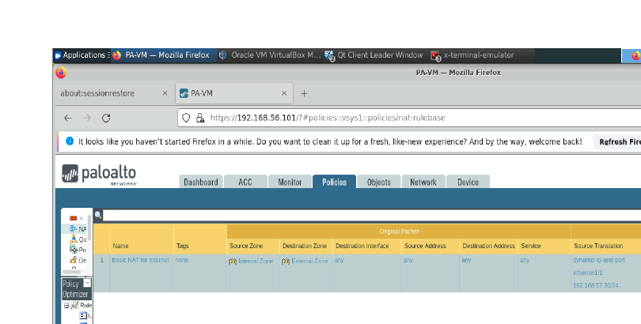
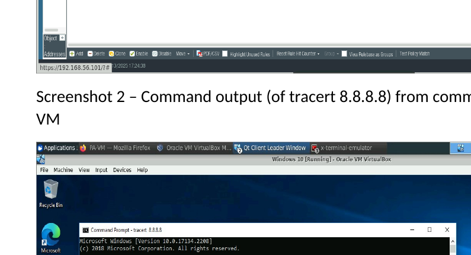
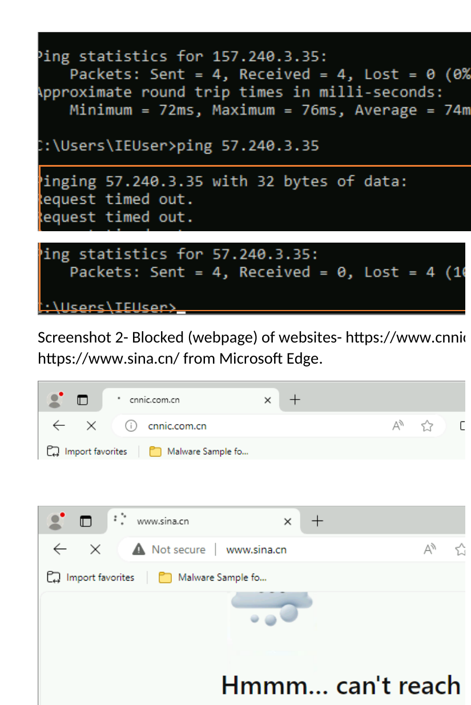

# Palo Alto Networks NGFW Configuration Lab

**Project completed:** 2025  
**Published to GitHub portfolio:** 2026

## 🔎 Project Overview

This project demonstrates hands-on configuration and administration of a Palo Alto Networks Next-Generation Firewall (NGFW).

The lab focused on identifying network interfaces, configuring device settings, creating a basic firewall security policy, validating traffic routing through the firewall, and applying website-blocking controls.

---

## 🎯 Project Objectives

- Identify Palo Alto lab network interfaces and IP addresses
- Configure Palo Alto device options
- Configure and verify a login banner
- Create a basic firewall security policy
- Validate traffic routing through the firewall
- Test connectivity using Windows command-line tools
- Apply firewall-based website blocking
- Verify blocked network and web traffic

---

## 🌐 Network Configuration

The lab environment included the following network elements:

| Component | IP Address |
|---|---|
| Host Machine | 10.0.0.4 |
| Management Interface | 192.168.56.101 |
| PA-VM Internal Interface | 10.0.2.20/24 |
| PA-VM External Interface | 192.168.57.30/24 |
| Windows 10 Machine | 10.0.2.4 |

---

## ⚙️ Device Configuration

The Palo Alto device options were configured and validated through the management interface.

A custom login banner was configured:

**Welcome Cyber Defenders!**

This demonstrated basic administrative configuration of the Palo Alto NGFW.

---

## 🛡️ Firewall Security Policy

A basic firewall security policy was created under:

**Policies → Security**

The policy was configured to control traffic between the internal and external network environments.

The configuration was then validated from the Windows 10 virtual machine using:

`tracert 8.8.8.8`

The traceroute output demonstrated that network traffic was being routed through the configured firewall environment.

---

## 🚫 Website Blocking

Firewall rules were also configured to restrict access to selected network destinations and websites.

Testing included:

- Ping-based connectivity testing
- Blocked network requests
- Browser-based website access testing
- Verification of denied web traffic

The lab demonstrated how firewall policies can be used to enforce network-access restrictions.

---

## 🛡️ Skills Demonstrated

- Palo Alto Networks NGFW
- Firewall Configuration
- Network Security
- Security Policy Administration
- Firewall Rule Management
- Network Interface Configuration
- Traffic Routing
- Access Control
- Website Blocking
- Network Troubleshooting
- Windows Network Utilities
- Security Administration

---

## 📈 Key Takeaways

This project strengthened my practical understanding of next-generation firewall configuration and policy enforcement.

The lab demonstrated how network interfaces, routing, security policies and access-control rules work together to manage and secure traffic through a firewall.

---

## 📸 Project Screenshots

### 1. Palo Alto Login Banner

### 2. Basic Firewall Security Policy

### 3. Traceroute Routing Validation

### 4. Website Blocking Validation

---

## 📄 Project Evidence

The completed Palo Alto NGFW configuration submission is included in this repository as supporting evidence.

[📄 View Palo Alto NGFW Configuration Submission](Palo%20Alto%20NGFW%20Configuration%20Submission.docx)

The project evidence demonstrates Palo Alto device configuration, security-policy creation, routing validation and website-blocking controls.

---

## 👨‍💻 Author

**Benard Obi Kekong**

Cybersecurity Analyst | CompTIA Security+ | SOC & GRC | Microsoft Sentinel | SIEM | Risk Assessment | Python
